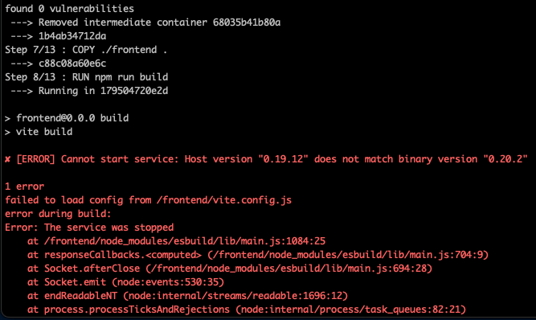

# Troubleshooting Issues with Docker

<style>
.highlight-light-purple {
color: #BF9ACA;
font-weight: bold;
}
.highlight-purple {
color: #AB52FF;
font-weight: bold;
}
.highlight-yellow {
color: #FEE440;
font-weight: bold;
}
.highlight-orange {
color: #EE964B;
font-weight: bold;  
}
.highlight-green {
color: #09E85E;
font-weight: bold;
}
.highlight-skyblue {
color: #72DDF7;
font-weight: bold;
}
.highlight-grey {
color: #D3D3D3;
font-weight: bold;
}
.highlight-red {
    color: #ED254E;
    font-weight: bold
}

</style>

I bet this will be a <strong class="highlight-red">hot</strong> repository!


This repo is where I am going to begin putting issues I run into often with Docker.

Over time it will become more organized as more resources and troubleshooting steps are added to the repo. But for now this will serve as a centralized place we can check to see if there is some helpful guidance on resolving a issue we are having, related to Docker.


So to kick us off, I've got a weird one that I ran into today, and luckily have seen at some point. Although I have a way to solve it, my understanding of the problem could still use some growth. Hopefully with some of the issues posted publicly here, someone may be able to contribute more helpful reasoning as to <strong class="highlight-purple">why</strong> these issues occurred in the first place.

If you have any interest in contributing, or have small portions that would be easy to send to me to update for you, send me a message or let me know!


Ok enough with the boring stuff, what's this first issue?


Well I created a project with a partner last month called `bouldercomp` running at `http://bouldercomp.com`. Right now the application is running in production, and we are collecting feedback on the application before we release a <strong class="highlight-skyblue">new</strong> version in the Fall, right as climbing conditions become good in our local area.

My partner made some changes, and unfortunately the changes did not work how we expected them to in production, so we needed to launch a new instance of our `old` code.

This is not much of a problem, the beauty of docker is that we have multiple images pushed for our versioning. So to go back to some `old` working code we can easily just pull an older image.


This solution works great, if you are reading this now and notice `http://bouldercomp.com` is not running, its because we are working on some things and will get it back up shortly. Our real release will be aligned with the climbing season.

Ok, Sorry none of that is important to troubleshooting Docker. So why am I telling you all this boring stuff?

Mostly because your issues will likely follow a similar pattern, you are doing some routine work. You go to run Docker, it does not work as you expect it to.


# [ERROR] Cannot start service: Host version binary does not match...


Ok, this is the error we ran into:




So what does this stuff even mean?

I'm not sure really, I do know a couple things thought:
1. My backend container seemed to build fine
2. I didn't see any issues with my postgres container
3. Docker tried to run <strong class="highlight-orange">npm run build</strong> and it caused an error


Ok, not too much to go off of.. but we at least know we probably shouldn't be looking at stuff related to python or postgres.

So at this point its probably helpful to look at what our `script` is executing.


# run-compose-prod

<details>
<summary>See run-compose-prod details</summary>

```


#!/bin/sh

# The Dockerhub account where the images are stored


# These environment variables come from command line arguments.
# They are consumed by the docker-compose file.

#####################################
export POSTGRES_DB=boulder_comp
export POSTGRES_USER=postgres
export PRODUCTION=true
#####################################

## Less sensitive variables above

## Sensitive variables that should be injected and shared with no one

#################################
#################################
export DOCKERHUB_UNAME=$1
export NEW_VERSION=$2
export HOST=$3

export DB_PASS=$4

export EMAIL=$5
export GMAIL_APP_PASSWORD=$6

export AWS_ACCESS_KEY_ID=$7
export AWS_SECRET_ACCESS_KEY=$8
export BUCKET_NAME=$9
#################################
#################################


COMPOSE_DOCKER_CLI_BUILD=0 DOCKER_BUILDKIT=0 docker-compose -f docker-compose.prod.yml build --no-cache
docker-compose -f docker-compose.prod.yml up -d

# make sure the postgres container is ready, then run migrations
sleep 10 
docker exec boulder_comp-api-1 python /src/manage.py makemigrations 
docker exec boulder_comp-api-1 python /src/manage.py migrate


```

</details>


The <strong class="highlight-green">run-compose-prod</strong> script is tryng to run a <strong class="highlight-skyblue">docker-compose</strong> file, and provide a bunch of arguments.

The important thing to note about thing to remember about this script, which we will get to in a second is that it uses docker <strong class="highlight-skyblue">images</strong>.

This means its intended for you to run the <strong class="highlight-green">build-and-push</strong> script prior to trying to run the <strong class="highlight-green">run-compose</strong>.

- So before running <strong class="highlight-green">run-compose</strong>
    - Ensure you have the appropriate images (run <strong class="highlight-green">build-and-push</strong> if necessary)


# docker-compose.yml 

Ok, this is not a script, this is the <strong class="highlight-yellow">docker-compose</strong> file that describes our docker configuration.

Its relevance, is that <strong class="highlight-green">run-compose-prod</strong> is essentually just running `docker-compose` with a bunch of arguments

<details>
<summary>See docker-compose prod for context</summary>

```

#########################################
# The "production" compose file builds 
# on your EC2 instance
#########################################

version: "3"
services:
  api:
    image: $DOCKERHUB_UNAME/boulder_comp_api-prod:$NEW_VERSION 
    environment:
      - PRODUCTION=$PRODUCTION
      - DB_PASS=$DB_PASS
      - EMAIL=$EMAIL
      - GMAIL_APP_PASSWORD=$GMAIL_APP_PASSWORD
      - HOST=$HOST
      - AWS_ACCESS_KEY_ID=$AWS_ACCESS_KEY_ID
      - AWS_SECRET_ACCESS_KEY=$AWS_SECRET_ACCESS_KEY
      - BUCKET_NAME=$BUCKET_NAME
    depends_on:
      - db
  nginx:
    image: $DOCKERHUB_UNAME/boulder_comp_webserver-prod:$NEW_VERSION
    restart: always
    ports:
      - "80:80"
  db:
    image: postgres:15
    volumes:
      - postgres_data:/var/lib/postgresql/data/
    environment:
      - POSTGRES_DB=$POSTGRES_DB
      - POSTGRES_USER=$POSTGRES_USER
      - POSTGRES_PASSWORD=$DB_PASS

volumes:
  postgres_data:


```


Theres a lot of stuff in here that we don't really need to worry about. A <strong class="highlight-yellow">docker-compose</strong> file, needs to `describe` a configuration setup.

- So what are we `describing` here?
    - We have a service `api` that will use an `image` we are giving it
    - We have a service `nginx` that will use an `image` we are giving it 
    - We have a service `db` that we will use an `image`
    - Our service `api` should wait for service `db` to start
    - We want a volume `postgres_data` associated with our `db` service

Ok it seems like a lot if we list it out. But what if we just said "I want to launch my frontend, backend, and database in their own containers"?

That, for the most part is what we are describing here.


</details>


In the <strong class="highlight-green">run-compose-prod</strong> I mentioned it was important to make sure you have your docker `images`.

This is because this `docker-compose` will `consume` those `images` to start the services. The benefit of running a `docker-compose` is that these services will all be within a single `container`.

So we end up with 1 master container that has 3 containers running inside of it.


# build-and-push-images

This script builds docker images out of your code, and pushes them up to your dockerhub

<details>
<summary>See build-and-push script (M-chip)</summary>

```

#!/bin/bash

##############################
# This builds and pushes both the nginx/React image
# and the DRF one.  
#
# The nginx/React image gets built with an environment variable
# that sets the url of the DRF backend REACT_APP_BASE_URL.  Once you
# know the IP address of your EC2 instance, you would pass that in
# instead of localhost
##############################


DOCKERHUB_UNAME=successphil


BASE_URL=$1
NEW_VERSION=$2
# DOCKERHUB_UNAME=$3

############################################################

# Command if building images on a mac with an M chip
############################################################
####################### Build Webserver ####################

docker buildx build --platform=linux/amd64 --build-arg VITE_BASE_URL=$BASE_URL -t $DOCKERHUB_UNAME/boulder_comp_webserver-prod:$NEW_VERSION -f webserver/Dockerfile . --no-cache

docker push $DOCKERHUB_UNAME/boulder_comp_webserver-prod:$NEW_VERSION

############################################################

######################## Build API #########################


docker buildx build --platform=linux/amd64 -t $DOCKERHUB_UNAME/boulder_comp_api-prod:$NEW_VERSION -f backend/Dockerfile ./backend --no-cache

docker push $DOCKERHUB_UNAME/boulder_comp_api-prod:$NEW_VERSION

```

</details>


<details>
<summary>See build-and-push script (intel-chip)</summary>


```

###############################################################
###############################################################
####################### Build WebServer #######################
###############################################################
###############################################################


# docker build --build-arg VITE_BASE_URL=$BASE_URL -t $DOCKERHUB_UNAME/boulder_comp_webserver-prod:$NEW_VERSION -f webserver/Dockerfile . --no-cache

# docker push $DOCKERHUB_UNAME/boulder_comp_webserver-prod:$NEW_VERSION

###############################################################
###############################################################
######################## Build API ############################
###############################################################
###############################################################

# docker build -t $DOCKERHUB_UNAME/boulder_comp_api-prod:$NEW_VERSION -f backend/Dockerfile ./backend --no-cache

# docker push $DOCKERHUB_UNAME/boulder_comp_api-prod:$NEW_VERSION

###############################################################
###############################################################

```
</details>

When you run the `build-and-push` you should see your `images` build on your local machine. When they complete, you should be able to see the `images` in your DockerHub repositories.

This verifies that you could `docker pull` the same images down to your local machine (or to an EC2 instance perhaps) and run your code off of your images.


# Back to the issue

Ok, the <strong class="highlight-green">run-compose-prod.sh</strong>, the <strong class="highlight-yellow">docker-compose.yml</strong>, and the <strong class="highlight-green">build-and-push.sh</strong> have been talked about above for context. 

When does our script try to run <strong class="highlight-orange">npm run build</strong>

We have already eliminated the idea of it having to do with our backend or database. So we have an issue related to our `frontend` code.


Lets again look at part of the <strong class="highlight-green">build-and-push</strong> script.

<details>
<summary>Pushing image for frontend code</summary>

```
docker buildx build --platform=linux/amd64 --build-arg VITE_BASE_URL=$BASE_URL -t $DOCKERHUB_UNAME/boulder_comp_webserver-prod:$NEW_VERSION -f webserver/Dockerfile . --no-cache

docker push $DOCKERHUB_UNAME/boulder_comp_webserver-prod:$NEW_VERSION
```

</details>

Okay the important part to look at here, is that we are using `-f` to specify where our `dockerfile` is.

In this case, this lets us know that we are trying to build a dockerfile from our webserver folder.


Great, we have somewhere to start. Lets look at our `dockerfile` in the webserver folder

<details>
<summary>Webserver dockerfile</summary>

```

###########################
# This is a "builder" pattern in Docker.
# We need to process our React code into static files that we can serve (npm run build).
# You could also skip this part and just run "npm run build" and copy over the output manually like some kind of barbarian
###########################

FROM node:20 as builder

WORKDIR /frontend

# These two lines will allow us to pass in an environment
# variable when the image is *built* (not run).  For local
# development, localhost; for production, your EC2's IP address
ARG VITE_BASE_URL=localhost:8000
ENV VITE_BASE_URL=$VITE_BASE_URL

COPY ./frontend/package.json .
RUN npm install && npm update
COPY ./frontend .
RUN npm run build

###########################
# This is the final image we want.
#  First, it copies over a config file which basically says:
# "if any requests come in whose uri starts with /api/,
# then hand them off to the gunicorn (Django) server, 
# otherwise, serve up the React static files."
# Second, it copies over the React static files to the place
# where nginx expects them to be.
###########################
FROM nginx:alpine

COPY ./webserver/default.conf /etc/nginx/conf.d/default.conf
COPY ./webserver/nginx.conf /etc/nginx

COPY --from=builder /frontend/dist /usr/share/nginx/html

```

# Webserver Image

Okay, theres a good bit going on here, and we have an issue that could be related to something here, so we are gonna look at the image a bit more.

First lets just describe what it looks like we want:

1. Build a Node Image
2. Cd into my frontend folder
3. Copy my package json
4. RUN `npm install` and `npm update`
5. Copy my front end folder
6. RUN `npm run build`
7. Run npm build
8. Build a nginx Image
9. Copy my nginx configuration to where nginx expects configuration files to be
10. Copy my additional nginx configuration to where nginx expects configuration files to be
11. Copy my frontend/dist into usr/share/nginx/html (a place where nginx expects html files to be)


Yikes! Thats a lot of steps, but remember we know a few things. We ran into this issue because when our container tried to run `npm run build` we got some weird error.


So what does our webserver image actually do?

If we look at the tasks we are trying to describe, it looks like we want to copy some files into some specific locations so that `nginx` can properly use the files.

If you look at the end of our script, those last lines help make our goal clear.

You might be thinking, but my frontend does not have a `dist` folder..

That is likely because you have not ran `npm run build`, we typically run our development servers with `npm run dev`


So these are just some node related things, which I have either figured out or learned over time.

When you have a node project (even an empty directory) and run a `node package manager` command like `npm install`

Node will generate some things for you.

Almost immediately you should generate at least a `package.json` and a `node_modules` folder.

While I don't know much about these things, `package.json` is what keeps track of your dependencies. I tend to think of node_modules as being similar to my python venv, and package.json being similar to a `requirements.txt` file.

When you `npm install` libraries and dependencies for your project, node updates your package json and node_modules appropriately.

When you run `npm run build` You should generate a `dist` folder. This is the code that actually runs in production.


So getting back to our troubleshooting, the first thing I tried was running `npm run build` locally.


Sure enough, it generated a dist folder for me. This step isn't necessary, but lets say I really want to run the code, it doesn't make feel good enough that I can generate it locally just fine.

<details>
<summary>Updating docker image to Run front end code directly</summary>

```
###########################
# This is a "builder" pattern in Docker.
# We need to process our React code into static files that we can serve (npm run build).
# You could also skip this part and just run "npm run build" and copy over the output manually like some kind of barbarian
###########################

FROM node:20 as builder

WORKDIR /frontend

# These two lines will allow us to pass in an environment
# variable when the image is *built* (not run).  For local
# development, localhost; for production, your EC2's IP address
ARG VITE_BASE_URL=localhost:8000
ENV VITE_BASE_URL=$VITE_BASE_URL


###########################
# This is the final image we want.
#  First, it copies over a config file which basically says:
# "if any requests come in whose uri starts with /api/,
# then hand them off to the gunicorn (Django) server, 
# otherwise, serve up the React static files."
# Second, it copies over the React static files to the place
# where nginx expects them to be.
###########################
FROM nginx:alpine

COPY ./webserver/default.conf /etc/nginx/conf.d/default.conf
COPY ./webserver/nginx.conf /etc/nginx

COPY --from=builder /frontend/dist /usr/share/nginx/html

```

We removed these lines, because by running `npm run build` locally, we already have a frontend/dist folder
```
COPY ./frontend/package.json .
RUN npm install && npm update
COPY ./frontend .
RUN npm run build
```

Remember what we are trying to do is just copy our html files, into a place where nginx knows what to do with html files


If for some reason, you can generate your codes `dist` folder locally, but cannot actually get the container to build, you probably have a problem somewhere in your code.

But if in my case, you can generate your `dist` locally, but now have to `build` your `dist` prior to running the script.. theres a few more things we can take a look at.


# What I ended up doing

You should not see node_module files or references to node_modules from docker. Ensure having a `.dockerignore` that similar to your `.gitignore` does not track `node_modules`

1. Checked that I could make a local dist from my frontend code
```
npm run build
```

2. I deleted the dist after it was made
```
rm -rf frontend/dist
```

3. I ran my local compose script, which failed for similar errors as our production script


4. I deleted my node_modules

```
rm -rf frontend/node_modules
```
5. I ran my local compose script again
It worked with the node_modules deleted

6. I shut down my containers and built and pushed new images

7. I pulled the images into our app and got it running again

8. I decided to change more things and broke stuff...


# Local Compose Script and docker-compose

These are pretty similar with just a couple slight differences.

<details>
<summary>local docker compose setup</summary>

docker-compose.dev.yml
```
version: "3"
services:
  api:
    build: ./backend
    ports:
      - "8000:8000"
    environment:
      - DB_PASS=$DB_PASS
      - EMAIL=$EMAIL
      - GMAIL_APP_PASSWORD=$GMAIL_APP_PASSWORD
      - HOST=$HOST
      - AWS_ACCESS_KEY_ID=$AWS_ACCESS_KEY_ID
      - AWS_SECRET_ACCESS_KEY=$AWS_SECRET_ACCESS_KEY
      - BUCKET_NAME=$BUCKET_NAME
    depends_on:
      - db
  nginx:
    build: 
      context: .
      dockerfile: ./webserver/Dockerfile
    restart: always
    ports:
      - "80:80"
  db:
    image: postgres:15
    volumes:
      - postgres_data:/var/lib/postgresql/data/
    environment:
      - POSTGRES_DB=$POSTGRES_DB
      - POSTGRES_USER=$POSTGRES_USER
      - POSTGRES_PASSWORD=$DB_PASS


volumes:
  postgres_data:

```

</details>

Your `run-compose` is still just running a `docker-compose` with a bunch of arguments

Your `docker-compose` is still building a bunch of images to run your code.

The main difference here is we are `building` and running images here.

You will notice our `run-compose-prod` uses `image` to declare which image to `pull` to use for the designated service.

Here in the `run-compose-dev` (or local) we are building docker images from our `code` to use for the container `services`


<details>
<summary>run-compose local script</summary>

```

##########################################################################
##########################################################################
### These are the environment variables docker-compose.dev.yml expects ###

    #  Less Sensitive variables 
#################################
export POSTGRES_DB=boulder_comp
export POSTGRES_USER=postgres
export HOST=localhost:80
export PRODUCTION=false
#################################

### The Above variables are not necessarily sensitive ###
###     So you may leave some values hard coded       ###
### In production, you will need to pass most of these ###

### So you may consider making your dev and prod scripts match ###
## The prod script will additionally need the container address and image version ###
#####################################################################################
### These are sensitive and should get injected at runtime and shared with no one ###

    # Variables to Inject
#################################
#################################
export EMAIL=$1
export GMAIL_APP_PASSWORD=$2
export AWS_ACCESS_KEY_ID=$3
export AWS_SECRET_ACCESS_KEY=$4
export BUCKET_NAME=$5
export DB_PASS=$6
#################################
#################################

# All variables exported should get consumed by docker-compose.dev.yml

########### Runs docker-compose.dev.yml with arguments that exist in script   ######################
#### Command may vary on different Machines

COMPOSE_DOCKER_CLI_BUILD=0 DOCKER_BUILDKIT=0 docker compose -f docker-compose.dev.yml up -d --build

# make sure the postgres container is ready, then run migrations
sleep 10
docker exec boulder_comp-api-1 python /src/manage.py makemigrations 
docker exec boulder_comp-api-1 python /src/manage.py migrate
```


Just like all the other examples, I think its helpful to see a script that is actually being used. There is a lot of stuff here that applies mostly to the `boulder comp` application.

This script is just helping us run a `docker-compose` with a bunch of arguments (and yes, wait and make migrations to the database)


This script is very similar to the `production` script. Both have essentially the same job, so why are there two scripts?

The `dev` script should run locally, meaning you can run your containers, and going to port 80, you will see nginx serving the content on your local machine

The `prod` script is intended to run on a `EC2` or some other hosting platform. The point is, you actually have to have that address (Your EC2, domain, the address your project will be running at)

The main differences are to make sure that the right arguments get passed, so that the containers work properly in development and production.

While we could combine scripts or make 1 script, it introduces the potential for more human error by creating configuration changes.

